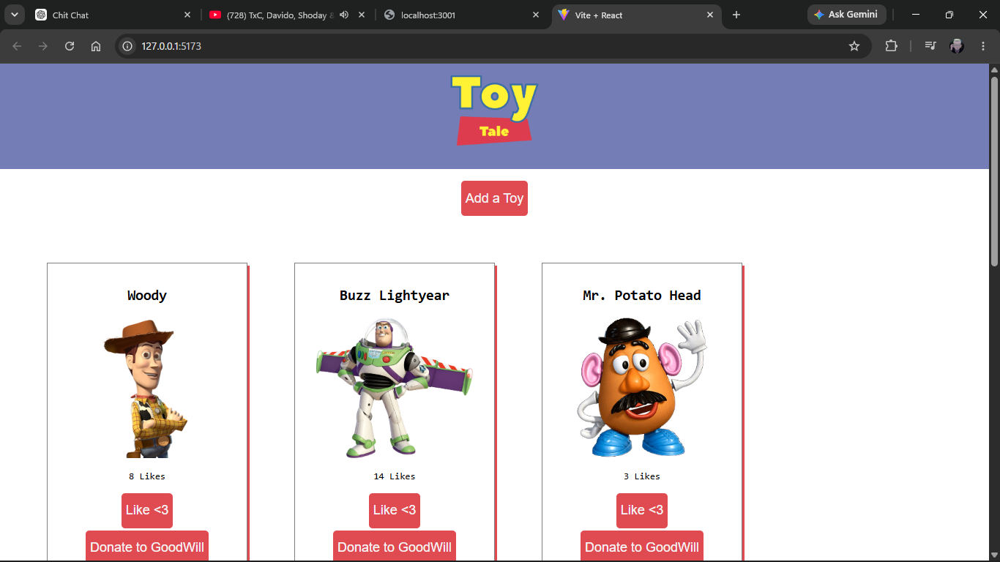

# Toy Tales

## Description

Toy Tales is a React application that allows users to manage a collection of toys. Users can view toys, add new toys, like existing toys, and donate toys.

## Features

- View all toys on page load
- Add new toys
- Increase toy likes
- Donate toys which also deletes them
- Persistent data using a backend API

## Technologies Used

- React
- JavaScript
- JSON Server
- CSS

## Installation

1. Clone the repository
   git clone <repository-url>

2. Install dependencies
   npm install

3. Start the backend
   npm run server

4. Start the React app
   npm run dev

## Website Screenshot

